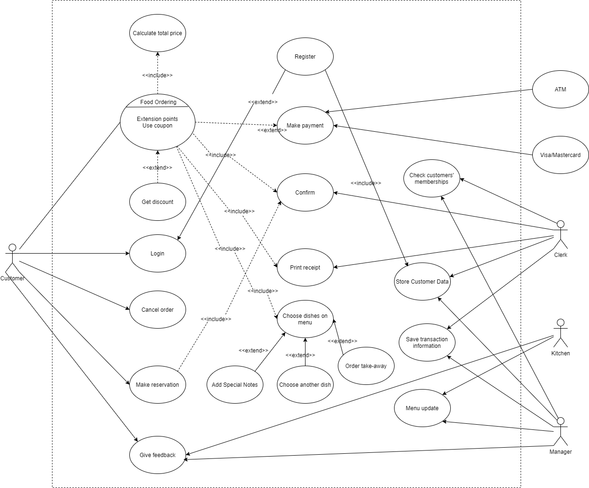
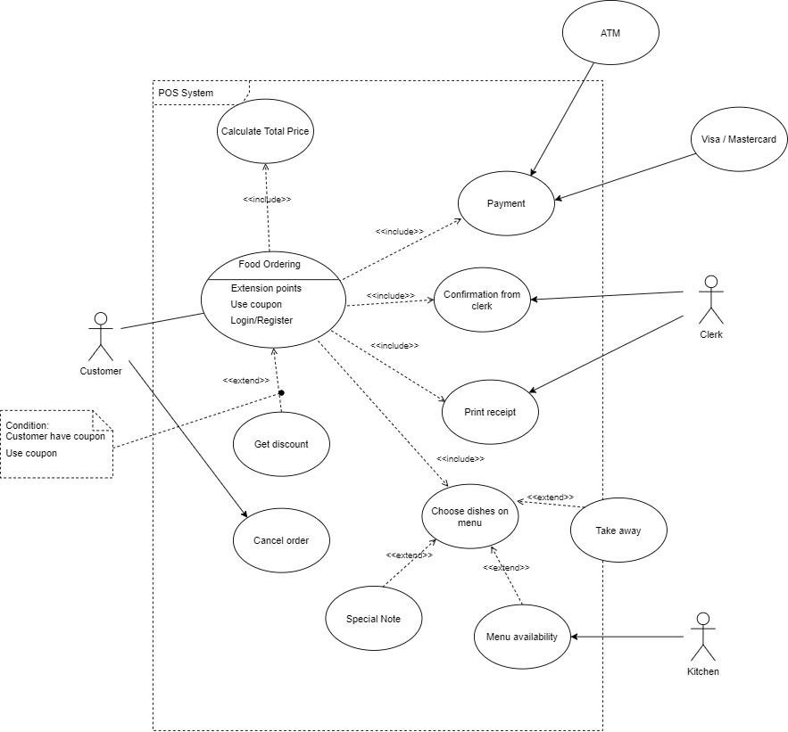

<h1 align="center">REQUIREMENTS FOR CRM-SYSTEM</h1>

**Contain:**
* [The Context Of The Project](#the-context-of-the-project)
* [Functional And Non-Functional Requirements](#functional-and-non-functional-requirements)
* [Use-Case Diagram](#use-case-diagram)

### The Context Of The Project

**Point of sale** (POS) or **point of purchase** (POP) is the time and place where a retail transaction is completed.
At the POS, the merchant calculates the amount owed by the customer, indicates that amount, may prepare an invoice for the customer, and indicates the options for the customer to make payment.
A restaurant POS system is a system of hardware and software that work together to handle workflow and transactions for a food and beverage business.

Even before the COVID-19 crisis, POS systems had sprung up everywhere across the industry.
During the Covid-19 pandemic, restaurants are facing greater peril than ever, modern restaurant POS systems are expected to help a restaurant thrive in many ways:
* Increase sales
* Improve customers experience
* Inform owners’ business decisions
* Reduce wasted effort
* Opportunity to scale to a large business

Many of the specific benefits within these categories are interconnected.
Make more informed business decisions, and your service will likely improve.
Improve your service, and your sales will see a boost as well – a happy domino effect that makes running a better business that much easier.

POS systems provide customers with a restaurant in their pockets, with simple and indirect access to all the restaurant services anywhere, at any time, which brings huge convenience.
This raises a plus point on customers’ mentality who concerns about health during COVID-19 pandemic.

**Stakeholders in the system:**
* Clerks: Create, confirm and record orders.
* Customers: Order and make payments.
* Kitchen Staff: Make food according to the orders.
* Owner: Manage the daily operations of the restaurant as well as its overall direction, profitability, and reputation.
* Suppliers: Supply the ingredients to the restaurant.
* Accountants: Analyzing data, finance reports, budgets, tax returns, and accounting records.

**Expected to be done:**
* Remote orders and reservations.
* Real-time menu updates
* System-integrated payment via multiple methods.
* System management:
  * Customers
  * Orders
  * Profits
* Can access through QR code and web browser
* Web-based

**The scope of the project:**
* Activities: Develop a new POS system for a restaurant model that follows some special requirements.
* Resources: **NONE**
* Deliverables: An extendable web-based POS terminal and relating documentations of the system should be delivered to the restaurant’s representatives.

### Functional And Non-Functional Requirements

**Functional requirements:** 
Customer side:
* Customers can create and cancel orders, add special notes, but only before confirmation from the clerk.
* Customers can create and delete table reservations, but only before confirmation from the clerk.
* Customers can order take-away meals.
* Customers can register for membership.
* Customers can give feedback, but only after payment.
* Customer can choose payment method and checkout.

Clerk side:
* Clerks can create, modify, delete and confirm incoming orders.
* Clerks can make table reservations.
* Clerks can check membership information based on customer’s phone number.
* Clerks can easily invoice payments.

Owner side:
* Receive email at the end of the day acknowledging today’s profit.
* Inherit privilege from clerk.
* Can see profit of the restaurant.
* Can create, modify menu.

Kitchen side:
* Can create and update menus.
* Be notified when a new order arrives.
* Can see details of arrived orders.

System side:
* Store customer information after membership registration.
* Store customer purchase and bill for later use.
* Send emails to the owner or restaurant manager to inform daily’s revenue.

**Non-functional requirements:**
* Clerks should be able to function the systems after 2 hours of training.
* Users should be able to use basic functions right away upon accessing the websites (make an order, reserve a table,...)
* System will be available 24/24.
* System will be multi-platform.
* Users don’t need to install in order to use this application.
* Can handle an average amount of 300 orders per day.
* Security: customers and transaction information are protected.
* Scalability: the system should be general enough and extendable for applying in other restaurants.
* Support multiple payment methods.
* Customer information and previous purchase should be stored for later use.

### Use-Case Diagram

The use-case diagram for the whole system:

    
     
    Use-case diagram for the whole system

The use-case diagram for the "**order food**" feature and its description:

    
     
    Use-case diagram for the "order food" feature

The description for the above diagram:

<table>
    <tr>
        <th>Use Case</th>
        <td>Order Food</td>
    </tr>
    <tr>
        <th>Description</th>
        <td>This use case describes how the Customer will order food</td>
    </tr>
    <tr>
        <th>Actor</th>
        <td>Customer, Clerk, Kitchen</td>
    </tr>
    <tr>
        <th>Precondition</th>
        <td>The customer is already on the order page</td>
    </tr>
    <tr>
        <th rowspan="6">Normal Flow</th>
        <td>1. Customer chooses food and requests to order.</td>
    </tr>
    <tr>
        <td>2. System presents a page with coupons for that order.</td>
    </tr>
    <tr>
        <td>3. Customer applies a coupon.</td>
    </tr>
    <tr>
        <td>4. System presents a page with payment methods.</td>
    </tr>
    <tr>
        <td>5. Customer chooses a payment method to checkout.</td>
    </tr>
    <tr>
        <td>6. System sends the Clerk the information to confirm the transaction.</td>
    </tr>
    <tr>
        <th rowspan="4">Exception</th>
        <td>
            Exception 1: at step 1 
            1a. If the restaurant is closed, the customer will not be able to order food.
        </td>
    </tr>
    <tr>
        <td>
            Exception 2: at step 1 
            1a. If any dishes were not available at the time customers make an order, the website will inform the customer.
        </td>
    </tr>
    <tr>
        <td>
            Exception 3: at step 3 
            3a. If the applied coupon is outdated or unavailable, system sends an error message.
        </td>
    </tr>
    <tr>
        <td>
            Exception 4: at step 5 
            5a. Customer cancels payment
        </td>
    </tr>
    <tr>
        <th rowspan="2">Alternative Flow</th>
        <td>
            Alternative 1: at step 3 
            3a. Customer do not use coupons. 
            Continue step 4 in the normal flow.
        </td>
    </tr>
    <tr>
        <td>
            Alternative 2: at step 5 
            5a. Customer change the payment method. 
            5b. System present the list of payment methods. 
            Continue step 5 in the normal flow.
        </td>
    </tr>
    <tr>
        <th>Requirement Met</th>
        <td>
            Non-direct contact between clerks and customers. 
            Allow Customer to be able to order food.
        </td>
    </tr>
</table>
